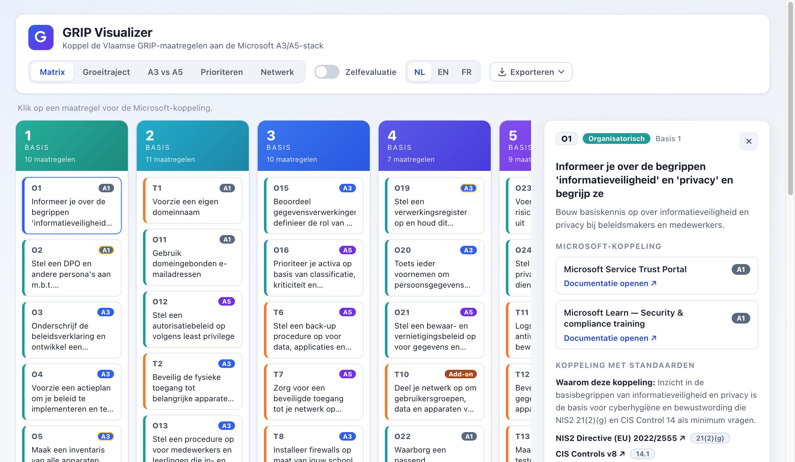

# GRIP Visualizer

Interactive website that maps the Flemish **GRIP** growth path (_Groeipad informatieveiligheid
en privacy voor het Vlaamse onderwijs_) to the **Microsoft A3/A5** stack. Built for education
organisations in Flanders, and reusable beyond it.

**Live site: [grip.ravensberg.org](https://grip.ravensberg.org/)**



> The Microsoft mapping is an **informative** starting point, **not licensing advice**. Always
> validate capability/tier availability against current Microsoft licensing.

## What it does

GRIP defines information-security & privacy measures across 6 maturity levels (_Basis_ 1–6).
GRIP Visualizer makes that growth path explorable and shows, for each measure, which Microsoft
capabilities help you deliver it and at which licence tier.

### Views

- **Matrix** — all GRIP measures across the 6 _Basis_ levels, faithful to the official PDF.
- **Journey** — the same data as a progressive roadmap from Basis 1 → 6.
- **A3 vs A5** — what A5 adds on top of A3, grouped per Microsoft product.
- **Prioritize** — measures grouped by implementation horizon (short / medium / long term),
  with an "achievable with A3 today" indicator to help you sequence the work.

### And more

- **Measure detail panel** — matching Microsoft products/features, licence tier (A1/A3/A5),
  add-on indicators, the value A5 or an add-on brings, and documentation links per measure.
- **Self-assessment** — score your organisation against each measure, entirely in the browser,
  with import/export of your results.
- **Export** — generate a PDF, PowerPoint or Markdown summary client-side.
- **Type & tier filters** — focus the Matrix/Journey by Organisational/Technical or by licence
  tier.
- **Trilingual UI** — Dutch / English / French. GRIP wording stays Dutch as the source of truth;
  non-Dutch translations are AI-generated, as noted in the in-app disclaimer.

## Getting started

Requires Node 24+.

```bash
npm install
npm run dev       # start the dev server on http://localhost:5173
```

Other useful commands:

```bash
npm run build     # production build into dist/
npm run preview   # preview the production build
npm run lint      # eslint
npm test          # vitest (unit/component tests)
npm run test:e2e  # playwright end-to-end tests (headless)
```

## End-to-end & privacy tests

[Playwright](https://playwright.dev/) drives the app in a real browser to cover the primary user
flows. The specs live in [`e2e/`](e2e/) and run against the Vite dev server (started automatically
by Playwright — see [`playwright.config.js`](playwright.config.js)).

```bash
npx playwright install --with-deps   # one-time: download browser binaries
npm run test:e2e                     # run the full suite headless
npm run test:e2e:ui                  # run with the interactive Playwright UI
npm run test:e2e -- --project=chromium e2e/privacy.spec.js   # a single project/spec
```

The same suite runs in CI on every pull request and on pushes to `main`
([`.github/workflows/e2e.yml`](.github/workflows/e2e.yml)): PRs validate against Chromium (desktop
and emulated mobile) for fast feedback, while `main`/manual runs exercise the full Chromium,
Firefox and WebKit matrix.

### Privacy assertion

[`e2e/privacy.spec.js`](e2e/privacy.spec.js) is a regression guard for the app's core promise —
**"All your data stays in your browser."** It exercises the data-handling flows (entering a
self-evaluation, importing a local JSON file via the file picker, rendering the result, and
exporting/downloading) while recording every outbound network request. The test **fails if any
request leaves the app's own origin**, so an accidentally introduced analytics call, upload
endpoint or third-party request would break the build. The client-side downloads (`blob:`/`data:`
URLs) and same-origin asset/dataset requests are expected and allowed. It is deterministic and
needs no external network access — the only fixture is the small, data-free
[`e2e/fixtures/assessment.json`](e2e/fixtures/assessment.json).

## Documentation

- **[ARCHITECTURE.md](ARCHITECTURE.md)** — tech stack, project layout, the `grip.json` data
  model and badge logic, and deployment.
- **[CONTRIBUTING.md](CONTRIBUTING.md)** — how to set up locally, edit translations and mappings,
  and the quality gates and release process.

## Source

Official GRIP matrix:
[Overzicht Groeipad informatieveiligheid en privacy (GRIP)](https://assets.vlaanderen.be/image/upload/v1770992646/repositories-prd/Overzicht_Groeipad_informatieveiligheid_en_privacy_GRIP_voor_het_Vlaamse_onderwijs_r0a7v2.pdf).

## Contributing

Contributions are very welcome — bug reports, fixes, new mappings, translations and docs.
See [CONTRIBUTING.md](CONTRIBUTING.md) to get started.

## License

Released under the [MIT License](LICENSE).
